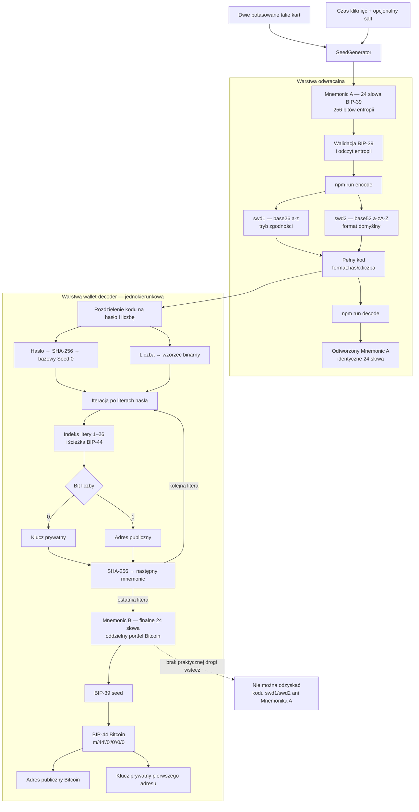

# Seed Generator Wallet Decoder

Lokalne narzędzie do **dokładnego, odwracalnego** przekształcania angielskiego mnemonika BIP-39 na parę `hasło + liczba` i z powrotem.

Projekt powstał jako bezpieczna realizacja przepływu łączącego:

- [Rav3nPL/SeedGenerator](https://github.com/Rav3nPL/SeedGenerator/tree/master) — źródło mnemonika wygenerowanego z kart i czasu kliknięć,
- [hattimon/wallet-decoder](https://github.com/hattimon/wallet-decoder) — inspirację interfejsem `hasło + liczba` oraz osobny tryb zgodności dla Bitcoin.

## Najważniejsze ograniczenie oryginalnej metody

`wallet-decoder` nie dekoduje seeda do hasła. Jest generatorem jednokierunkowym:

```text
hasło + liczba -> SHA-256 -> BIP-39 -> BIP-44 -> kolejne SHA-256 -> mnemonic
```

Nie da się praktycznie znaleźć hasła i liczby, które odtworzą dowolny, wcześniej losowo wygenerowany mnemonic z SeedGenerator. Dlatego projekt ma dwa rozdzielone tryby:

1. `encode` / `decode` — odwracalne formaty `swd1` i `swd2`, które gwarantują odzyskanie identycznego mnemonika;
2. `legacy` — zgodny z algorytmem `wallet-decoder` dla domyślnej sieci Bitcoin, ale celowo opisany jako jednokierunkowy.

## Przepływ właściwy dla tego projektu



`swd2` koduje prefiks entropii w alfabecie 52 znaków (`a-zA-Z`), dlatego dla mnemonika 24-wyrazowego hasło ma 38 zamiast 46 znaków, bez zmniejszania liczby zakodowanych bitów. Wielkość liter ma znaczenie i wpływa na wynik `wallet-decoder`. Para `hasło + liczba` zawiera tę samą tajną entropię co mnemonic i musi być chroniona równie starannie.

## Wymagania i instalacja

- Node.js 22 lub nowszy;
- Git;
- internet jest potrzebny tylko do sklonowania repozytorium i wykonania `npm ci`;
- wszystkie operacje na seedzie odbywają się lokalnie.

### Windows PowerShell

```powershell
git clone https://github.com/hattimon/Seed-Generator-Wallet-Decoder.git
Set-Location Seed-Generator-Wallet-Decoder
npm ci
npm run check
```

### Linux / macOS

```bash
git clone https://github.com/hattimon/Seed-Generator-Wallet-Decoder.git
cd Seed-Generator-Wallet-Decoder
npm ci
npm run check
```

Zależności są przypięte do konkretnych wersji w `package-lock.json`.

### Uruchamianie

```powershell
npm run encode
npm run encode:v1
npm run decode
npm run legacy:12
npm run legacy:24
```

### Aktualizacja istniejącej instalacji

```powershell
git pull origin main
npm ci
npm run check
```

## Użycie

### 1. SeedGenerator -> hasło i liczba

Wygeneruj mnemonic w SeedGenerator, zamknij inne aplikacje i uruchom:

```powershell
npm run encode
```

Wklej mnemonic do ukrytego promptu. Program zwróci:

- domyślnie hasło `swd2` z liter `a-zA-Z`,
- liczbę dziesiętną,
- minimalny kod w formacie `swd2:hasło:liczba`,
- rekomendowany kod papierowy `swd2:hasło:liczba:liczba_słów`.

Jeżeli potrzebny jest stary format base26, użyj:

```powershell
npm run encode:v1
```

Istniejące kody `swd1` pozostają w pełni obsługiwane.

#### Zgodność `swd1` i `swd2`

Oba formaty odtwarzają ten sam wejściowy mnemonic A, ale ich hasła i liczby są różne. W konsekwencji przekazanie danych `swd2` do `wallet-decoder` wygeneruje inny mnemonic B niż dane `swd1`.

- aby odtworzyć wcześniej używany portfel legacy, zachowaj jego oryginalny kod `swd1`;
- aby ponownie wygenerować kod `swd1` z mnemonika A, użyj `npm run encode:v1`;
- nie zastępuj backupu `swd1` kodem `swd2`, jeżeli zależy Ci na tym samym finalnym portfelu legacy.

#### Minimalny zapis na papierze

Technicznie wystarczają trzy pola, ponieważ wersja i długość mnemonika są już zapisane wewnątrz liczby:

```text
swd2:<hasło-z-zachowaniem-wielkości-liter>:<liczba>
```

Do ręcznego backupu rekomendowany jest wariant z jawną liczbą słów:

```text
swd2:<hasło-z-zachowaniem-wielkości-liter>:<liczba>:24
```

Dekoder obsługuje oba warianty. W zapisie czteropolowym sprawdza, czy końcowe `12`, `15`, `18`, `21` albo `24` zgadza się z długością zakodowaną w liczbie. To pole jest nadmiarowe celowo — pomaga wykryć pomyłkę na papierze.

Przy kilku seedach dodaj identyfikator poza kodem, na przykład:

```text
A01  swd2:<hasło-1>:<liczba-1>:24
A02  swd2:<hasło-2>:<liczba-2>:24
```

Identyfikator `A01`/`A02` nie jest wpisywany do programu. Nie zmieniaj wielkości liter, nie dodawaj spacji wewnątrz kodu i zapisuj dwukropki. Dla dalszego przepływu przez obecny tryb `legacy` sieć jest stała (`Bitcoin`); warto obok backupu zanotować `legacy: Bitcoin/24`.

### 2. Hasło i liczba -> identyczny seed

```powershell
npm run decode
```

Wklej kod trzy- lub czteropolowy w wersji `swd1` albo `swd2`. Program rozpozna wersję, zweryfikuje sumę kontrolną i odtworzy dokładnie ten sam mnemonic.

### 3. Tryb zgodności z wallet-decoder

```powershell
npm run legacy:24
```

Użyj `legacy:12` albo `legacy:24`. Obsługiwana jest sieć Bitcoin (domyślna ścieżka `m/44'/0'/0'/0/index`). Ten tryb zachowuje regułę liter `A-Z/a-z`, binarny wzorzec liczby oraz wybór klucza prywatnego/adresu publicznego z oryginału. Wielkość liter hasła zmienia wynik. Wyniku nie można odwrócić do hasła.

## Automatyzacja bez argumentów zawierających sekrety

Przy wejściu potokowym `encode` przyjmuje mnemonic, a `decode` pełny kod. Nie przekazuj prawdziwego seeda jako argumentu procesu ani nie zapisuj go w historii powłoki.

```powershell
Get-Content -Raw .\mnemonic.txt | npm --silent run encode:json
Get-Content -Raw .\recovery-code.txt | npm --silent run decode:json
```

Po użyciu bezpiecznie usuń pliki tymczasowe zgodnie z zasadami swojego systemu. Program sam nie zapisuje seedów ani kluczy na dysku.

## Weryfikacja

```powershell
npm run check
```

Testy obejmują wszystkie długości entropii BIP-39: 128, 160, 192, 224 i 256 bitów, round-trip `swd1` i `swd2`, zgodność istniejących kodów `swd1`, rozróżnianie wielkości liter, wykrywanie zmian hasła/liczby oraz wektor trybu legacy porównany z oryginalnym skryptem.

Przed użyciem z realnymi środkami wykonaj niezależny audyt kodu i test na pustym portfelu. Szczegóły formatu są w [docs/ARCHITECTURE.md](./docs/ARCHITECTURE.md), a model bezpieczeństwa w [docs/SECURITY.md](./docs/SECURITY.md).
