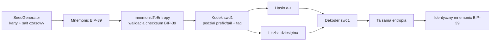

# Architektura i format `swd1`

## Cel

Format `swd1` jest bijekcyjnym kodowaniem entropii BIP-39. Nie próbuje odwracać SHA-256 z `wallet-decoder`; przenosi bity entropii bez utraty informacji i dodaje metadane oraz sumę kontrolną.

## Komponenty



- `src/recovery-codec.js` — odwracalny kodek;
- `src/legacy-wallet-decoder.js` — jednokierunkowy generator zgodności dla Bitcoin;
- `src/cli.js` — interfejs offline i ukryte prompty;
- `test/` — testy jednostkowe i wektory round-trip.

## Kodowanie

Obsługiwane są standardowe długości entropii BIP-39: 16, 20, 24, 28 i 32 bajty.

1. Z mnemonika odzyskiwana jest entropia i weryfikowana suma kontrolna BIP-39.
2. Ostatnie 40 bitów entropii trafia do liczby.
3. Pozostały prefiks jest kodowany pozycyjnie w bazie 26 jako małe litery `a-z` ze stałą długością.
4. Liczba zawiera nagłówek wersji, kod długości entropii, 40-bitowy ogon oraz 24-bitowy tag kontrolny.
5. Pełny zapis ma postać `swd1:<hasło>:<liczba>`.

Układ liczby od najbardziej znaczących bitów:

```text
version (>=1 bit) | length_code (3 bity) | entropy_tail (40 bitów) | tag (24 bity)
```

W wersji 1 `version = 1`, a `length_code = 0..4` odpowiada kolejno 128..256 bitom entropii. Tag to pierwsze 24 bity:

```text
SHA-256("SeedGeneratorWalletDecoder/recovery-v1\0" || entropy)
```

Tag służy do wykrywania pomyłek, nie do uwierzytelniania ani szyfrowania. Szansa przypadkowego niewykrycia błędnej pary to około 1 na 16,7 miliona.

## Dlaczego oryginalnego wallet-decoder nie da się użyć do odwracania

Pierwszy mnemonic oryginalnego programu powstaje z `SHA-256(password)`. Kolejne kroki haszują klucze prywatne albo adresy uzyskane z BIP-44. Dla losowego celu znalezienie wejścia SHA-256 jest problemem preimage, a dalsze kroki nie zachowują informacji potrzebnej do odtworzenia hasła.

Tryb `legacy` zachowuje algorytm generowania dla Bitcoin, aby można było otrzymać deterministyczny mnemonic z wcześniej znanego hasła i liczby. Nie jest częścią formatu `swd1`.

## Niezmienniki

- `decode(encode(mnemonic))` zwraca identyczny znormalizowany mnemonic;
- zmiana hasła albo liczby z bardzo wysokim prawdopodobieństwem kończy się błędem tagu;
- hasło ma kanoniczną długość i używa wyłącznie małych liter;
- liczba nie ma znaku ani zer wiodących;
- format nie zapisuje automatycznie żadnych sekretów.
