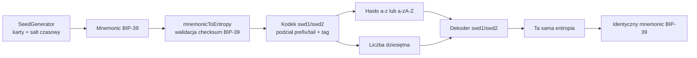

# Architektura formatów `swd1` i `swd2`

## Cel

Formaty `swd1` i `swd2` są bijekcyjnym kodowaniem entropii BIP-39. Nie próbują odwracać SHA-256 z `wallet-decoder`; przenoszą bity entropii bez utraty informacji i dodają metadane oraz sumę kontrolną. `swd2` jest formatem domyślnym.

## Komponenty



- `src/recovery-codec.js` — odwracalny, wersjonowany kodek `swd1`/`swd2`;
- `src/legacy-wallet-decoder.js` — jednokierunkowy generator zgodności dla Bitcoin;
- `src/cli.js` — interfejs offline i ukryte prompty;
- `test/` — testy jednostkowe i wektory round-trip.

## Kodowanie

Obsługiwane są standardowe długości entropii BIP-39: 16, 20, 24, 28 i 32 bajty.

1. Z mnemonika odzyskiwana jest entropia i weryfikowana suma kontrolna BIP-39.
2. Ostatnie 40 bitów entropii trafia do liczby.
3. Pozostały prefiks jest kodowany pozycyjnie ze stałą długością, zgodnie z wersją formatu.
4. Liczba zawiera nagłówek wersji, kod długości entropii, 40-bitowy ogon oraz 24-bitowy tag kontrolny.
5. Pełny zapis ma postać `<format>:<hasło>:<liczba>`.

| Format | Wersja | Alfabet hasła | Długość dla 24 słów | Zastosowanie |
| --- | ---: | --- | ---: | --- |
| `swd1` | 1 | base26: `a-z` | 46 znaków | zgodność z istniejącymi kodami |
| `swd2` | 2 | base52: `a-zA-Z` | 38 znaków | format domyślny, krótsze hasło |

Base52 nie zmniejsza bezpieczeństwa: koduje te same bity w większym alfabecie. Wielkość liter jest częścią danych, więc zamiana `a` na `A` zmienia wartość hasła i zostanie wykryta przez tag kontrolny.

### Format papierowy

Minimalny kod maszynowy zawiera trzy pola:

```text
<format>:<hasło>:<liczba>
```

Rekomendowany zapis papierowy dodaje jawny `word_count`:

```text
<format>:<hasło>:<liczba>:<word_count>
```

`word_count` jest informacją redundantną, ponieważ długość entropii znajduje się już w nagłówku liczby. Dekoder wymaga zgodności obu wartości, więc czwarty element pomaga wykryć błąd ręcznego zapisu. Nie bierze udziału w rekonstrukcji entropii.

Układ liczby od najbardziej znaczących bitów:

```text
version (>=1 bit) | length_code (3 bity) | entropy_tail (40 bitów) | tag (24 bity)
```

`length_code = 0..4` odpowiada kolejno 128..256 bitom entropii. Wartość `version` wynosi 1 dla `swd1` i 2 dla `swd2`. Tag to pierwsze 24 bity odpowiedniej domeny wersji:

```text
SHA-256("SeedGeneratorWalletDecoder/recovery-v1\0" || entropy)
SHA-256("SeedGeneratorWalletDecoder/recovery-v2\0" || entropy)
```

Tag służy do wykrywania pomyłek, nie do uwierzytelniania ani szyfrowania. Szansa przypadkowego niewykrycia błędnej pary to około 1 na 16,7 miliona.

### Znaczenie podziału `prefix/tail`

Dla entropii 256-bitowej hasło koduje 216-bitowy prefiks, a liczba zawiera 40-bitowy ogon. Nagłówek oraz 24-bitowy tag są metadanymi kontrolnymi. Podział służy formatowaniu danych i zgodności z interfejsem `hasło + liczba`; kompletny rekord nadal reprezentuje wszystkie 256 bitów entropii bez ich ograniczania. Projekt nie przypisuje osobnych właściwości bezpieczeństwa każdemu polu i nie opisuje tego układu jako 2FA ani kryptograficznego secret sharing.

## Dlaczego oryginalnego wallet-decoder nie da się użyć do odwracania

Pierwszy mnemonic oryginalnego programu powstaje z `SHA-256(password)`. Kolejne kroki haszują klucze prywatne albo adresy uzyskane z BIP-44. Dla losowego celu znalezienie wejścia SHA-256 jest problemem preimage, a dalsze kroki nie zachowują informacji potrzebnej do odtworzenia hasła.

Tryb `legacy` zachowuje algorytm generowania dla Bitcoin, aby można było otrzymać deterministyczny mnemonic z wcześniej znanego hasła i liczby. Nie jest częścią formatów `swd1`/`swd2`. Wielkość liter wpływa na początkowy SHA-256, dlatego jej zmiana prowadzi do innego finalnego mnemonika.

## Niezmienniki

- `decode(encode(mnemonic))` zwraca identyczny znormalizowany mnemonic dla obu wersji;
- wszystkie istniejące kody `swd1` pozostają dekodowalne;
- zmiana hasła albo liczby z bardzo wysokim prawdopodobieństwem kończy się błędem tagu;
- hasło ma kanoniczną długość i używa alfabetu przypisanego do wersji;
- liczba nie ma znaku ani zer wiodących;
- format nie zapisuje automatycznie żadnych sekretów.
